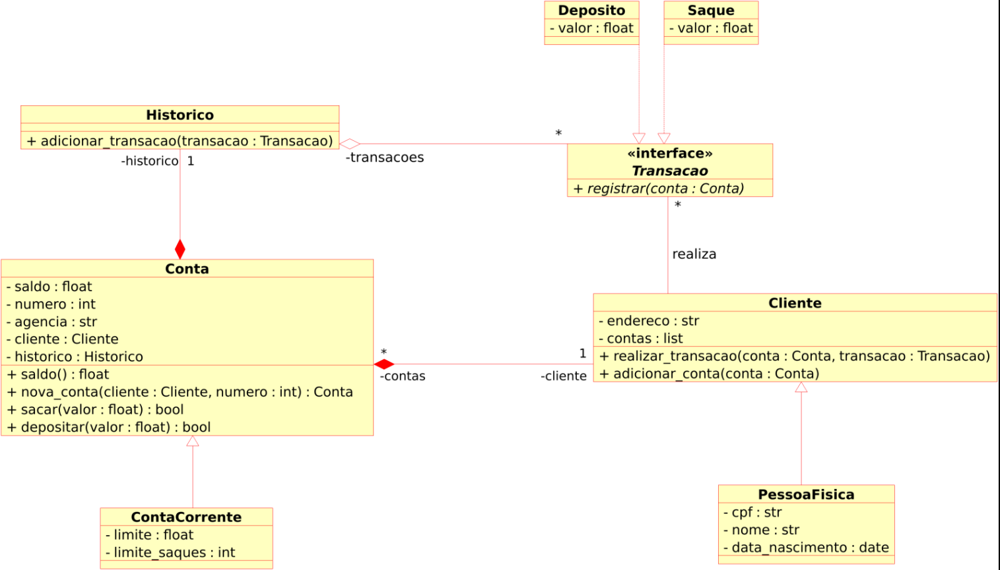

# Desafio DIO Criar o sistema bancário com orientação a objetos

## Objetivos

- O objetivo geral é iniciar A modelagem no sistema bancário em programação orientada a objetos e adicionar classes para cliente e as operações bancárias depósito e saque.
- O que precisamos fazer é atualizar a implementação do sistema bancário para armazenar os dados de clientes e contas bancárias em objetos ao invés de dicionários.
- O código deve seguir o modelo UML de classes a seguir:

## Classe conta

A classe conta deve ter:

- saldo;
- número;
- agência;
- cliente;
- e histórico;
- todos como atributos da classe e eles são privados (sinal de menos)
- 4 métodos:
  - saldo - não recebe nenhum argumento ele retorna float;
  - nova conta - é um método que cria uma conta (método de fábrica) então ele vai receber um cliente e o número da conta que pode ser um temporário, e tem retornar o objeto contra;
  - a operação de sacar - recebe um valor que é float e retorna um boleano;
  - e o depositar recebe um valor que é float e retorna boleano, para que se a operação aconteceu com sucesso ou falha retorna True se deu certo sacar, e caso se não depositar retorna falso, se deu errado e não depositar, por falso se deu errado também.

## Conta corrente com herança

A Conta ela tem uma classe filha, então aqui a conta corrente estende a conta porque é uma classe do tipo conta, então ela tem tudo que a conta tem mais dois atributos que seriam: o limite e o limite de saques.

## Atributo Histórico

Ainda continuando na conta temos o histórico, ele é um tipo de classe e essa classe é histórica, então uma conta tem um histórico, que pertence a uma conta.

### Interface Transação

- O histórico tem um método que é adicionar transação, ele também tem um argumento que são as transações, onde se depositando transações, que é do tipo transação, esta é uma interface, onde essa interface que seria a classe abstrata.
- Aclasse abstrata Interface, é uma classe pai, então ela tem um método registrar que recebe uma conta, assim também temos duas classes que implementam essa interface.
- As classe que implementam a abstrata da transação são: uma de depósito e a outra é a de saque, ambas tem os atributos do valor e consequentemente a implementação do método registrar.

## Classe cliente

A classe cliente tem:

- endereço;
- e tem uma lista de contas - que é do tipo conta;
- 2 operações:
  - o primeiro é realizar transação - ele recebe dois atributos, que seria uma conta e a transação, onde a conta é do tipo conta e a transação é do tipo aqui da classe que estava na transação, então pode ser um saque, passar um depósito, mas a gente vai olhar ai para saber se temos um **polimorfismo**.
  - Adicionar conta - lembrando que o meu cliente pode ter várias contas, e com várias contas onde a conta é relacionada a um cliente e temos uma **generalização**.

### Pessoa física

A classe pessoa física e é um tipo de cliente, ela tem:

- CPF;
- nome;
- data de nascimento.

## Referência

[Digital Innovation One - trilha-python-dio](https://github.com/digitalinnovationone/trilha-python-dio/)
